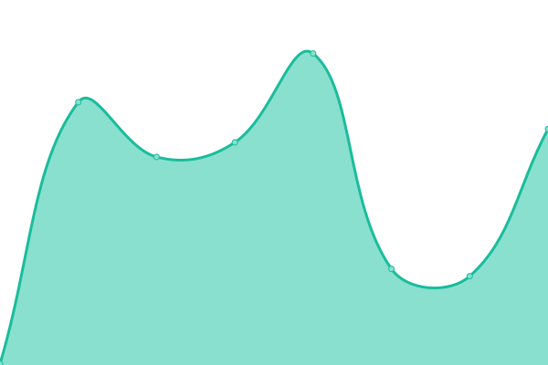
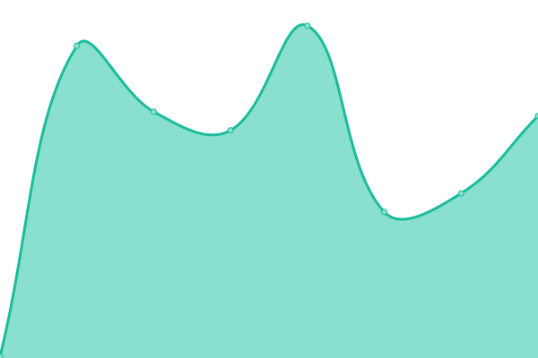
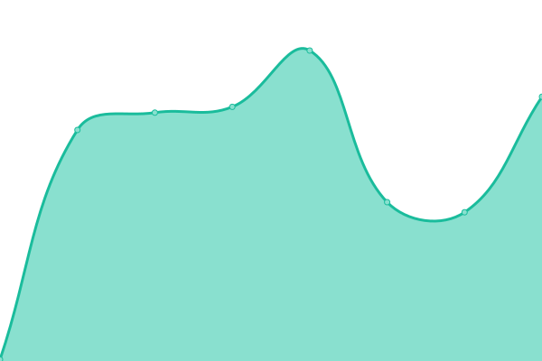
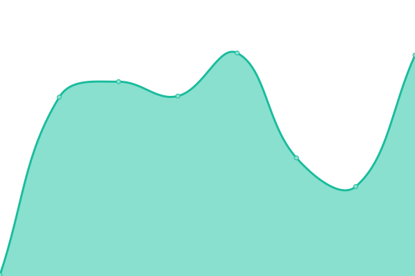
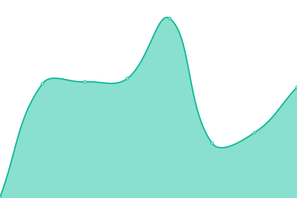

# [📈 Live Status](https://upptime.github.io/upptime): <!--live status--> **🟧 Partial outage**

This repository contains the open-source uptime monitor and status page for [Upptime](https://upptime.js.org), powered by [Upptime](https://github.com/upptime/upptime).

With [Upptime](https://upptime.js.org), you can get your own unlimited and free uptime monitor and status page, powered entirely by a GitHub repository. We use [Issues](https://github.com/upptime/upptime/issues) as incident reports, [Actions](https://github.com/rechemendiaatix/moe-sites-status/actions) as uptime monitors, and [Pages](https://upptime.github.io/upptime) for the status page.

<!--start: status pages-->
<!-- This summary is generated by Upptime (https://github.com/upptime/upptime) -->
<!-- Do not edit this manually, your changes will be overwritten -->
<!-- prettier-ignore -->
| URL | Status | History | Response Time | Uptime |
| --- | ------ | ------- | ------------- | ------ |
|  [MoE-Frontend-Develop](https://frontend.develop.moe-digital-id.apps.atixlabs.xyz) | 🟩 Up | [mo-e-frontend-develop.yml](https://github.com/rechemendiaatix/moe-sites-status/commits/HEAD/history/mo-e-frontend-develop.yml) | 

 172ms
     
 | 

<a href="https://rechemendiaatix.github.io/moe-sites-status/history/mo-e-frontend-develop">99.63%</a>
    

|  [MoE-Backend-Develop](https://api.develop.moe-digital-id.apps.atixlabs.xyz/healthcheck) | 🟩 Up | [mo-e-backend-develop.yml](https://github.com/rechemendiaatix/moe-sites-status/commits/HEAD/history/mo-e-backend-develop.yml) | 

 197ms
     
 | 

<a href="https://rechemendiaatix.github.io/moe-sites-status/history/mo-e-backend-develop">99.65%</a>
    

|  [MoE-Frontend-Staging](https://frontend.staging.moe-digital-id.apps.atixlabs.xyz) | 🟥 Down | [mo-e-frontend-staging.yml](https://github.com/rechemendiaatix/moe-sites-status/commits/HEAD/history/mo-e-frontend-staging.yml) | 

 391ms
     
 | 

<a href="https://rechemendiaatix.github.io/moe-sites-status/history/mo-e-frontend-staging">100.00%</a>
    

|  [MoE-Backend-Staging](https://api.staging.moe-digital-id.apps.atixlabs.xyz/healthcheck) | 🟥 Down | [mo-e-backend-staging.yml](https://github.com/rechemendiaatix/moe-sites-status/commits/HEAD/history/mo-e-backend-staging.yml) | 

 387ms
     
 | 

<a href="https://rechemendiaatix.github.io/moe-sites-status/history/mo-e-backend-staging">100.00%</a>
    

|  [MoE-Frontend-UAT-Phase1](https://frontend.uat-phase1.moe-digital-id.apps.atixlabs.xyz) | 🟩 Up | [mo-e-frontend-uat-phase1.yml](https://github.com/rechemendiaatix/moe-sites-status/commits/HEAD/history/mo-e-frontend-uat-phase1.yml) | 

 177ms
     
 | 

<a href="https://rechemendiaatix.github.io/moe-sites-status/history/mo-e-frontend-uat-phase1">100.00%</a>
    

|  [MoE-Backend-UAT-Phase1](https://api.uat-phase1.moe-digital-id.apps.atixlabs.xyz/healthcheck) | 🟩 Up | [mo-e-backend-uat-phase1.yml](https://github.com/rechemendiaatix/moe-sites-status/commits/HEAD/history/mo-e-backend-uat-phase1.yml) | 

 201ms
     
 | 

<a href="https://rechemendiaatix.github.io/moe-sites-status/history/mo-e-backend-uat-phase1">100.00%</a>
    

|  [MoE-Frontend-UAT-Phase2](https://frontend.uat-phase2.moe-digital-id.apps.atixlabs.xyz) | 🟩 Up | [mo-e-frontend-uat-phase2.yml](https://github.com/rechemendiaatix/moe-sites-status/commits/HEAD/history/mo-e-frontend-uat-phase2.yml) | 

 232ms
     
 | 

<a href="https://rechemendiaatix.github.io/moe-sites-status/history/mo-e-frontend-uat-phase2">100.00%</a>
    

|  [MoE-Backend-UAT-Phase2](https://api.uat-phase2.moe-digital-id.apps.atixlabs.xyz/healthcheck) | 🟩 Up | [mo-e-backend-uat-phase2.yml](https://github.com/rechemendiaatix/moe-sites-status/commits/HEAD/history/mo-e-backend-uat-phase2.yml) | 

 226ms
     
 | 

<a href="https://rechemendiaatix.github.io/moe-sites-status/history/mo-e-backend-uat-phase2">100.00%</a>
    

<!--end: status pages-->

[**Visit our status website →**](https://upptime.github.io/upptime)

## 📄 License

- Powered by: [Upptime](https://github.com/upptime/upptime)
- Code: [MIT](./LICENSE) © [Upptime](https://upptime.js.org)
- Data in the `./history` directory: [Open Database License](https://opendatacommons.org/licenses/odbl/1-0/)
